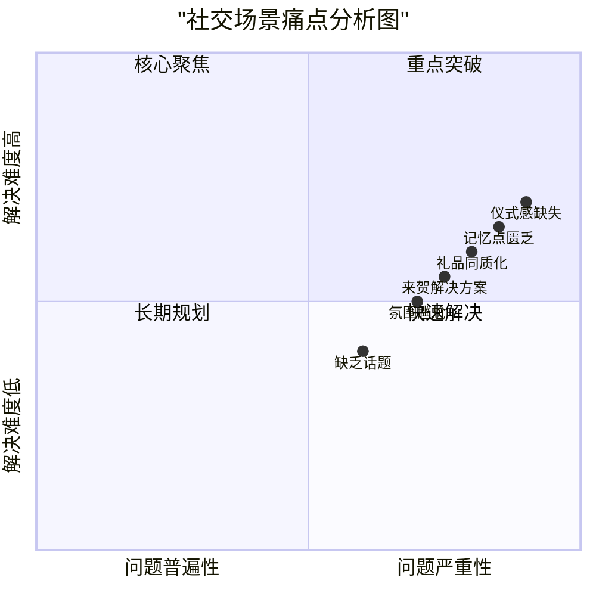

# 来贺白酒移动端官网 PRD V2.0

## 1. 项目概述

### 1.1 背景分析
当代社交环境下，人们普遍面临以下困境：
- 社交场合缺乏有趣的互动话题
- 商务礼品同质化严重，难以留下深刻印象
- 重要场合缺乏能够创造记忆点的仪式感

### 1.2 项目目标
- 建立以用户情感共鸣为核心的品牌形象
- 打造独特的社交白酒新品类定位
- 提供解决用户社交困境的创新解决方案

### 1.3 用户故事
- 作为一名商务人士，我希望送出的礼物能让对方记住，而不是随意收下就被遗忘
- 作为婚礼新人，我希望在重要时刻有独特的方式留下美好回忆
- 作为宴会主人，我希望能让酒桌氛围更加活跃，让客人感受到诚意与重视

## 2. 产品设计方案

### 2.1 首屏设计 - 情感共鸣区
#### 设计理念
采用"闪卡"式交互设计，通过3-4张快速切换的情景卡片，直击用户痛点：

#### 闪卡内容示例
1. 【场景卡】：重要饭局上的沉默尴尬
   - 文案：「又是一片沉默，大家低头看手机」
   - 设计：暗色调，突出尴尬氛围

2. 【场景卡】：被随意对待的礼物
   - 文案：「精心挑选的礼物，转眼被遗忘」
   - 设计：礼物堆积角落的场景

3. 【解决卡】：来贺带来的改变
   - 文案：「一个优雅的仪式，让每个重要时刻都被铭记」
   - 设计：展示互动场景的温暖画面

### 2.2 产品展示区改版

#### 核心展示逻辑
1. 先情感，后产品
2. 先价值，后细节
3. 先体验，后购买

#### 分区设计
1. 【情感价值区】
   - 主标题：「让重要时刻更值得纪念」
   - 动态展示：酒会互动、印记留念等场景

2. 【产品特色区】
   - 精致手工艺展示
   - 材质品质特写
   - 互动演示动画

3. 【场景应用区】
   - 商务赠礼
   - 婚宴庆典
   - 重要节日

### 2.3 交互设计

#### 创新互动元素
1. 虚拟体验
   - 3D展示酒品细节
   - 模拟印记互动效果

2. 社交分享
   - 场景定制化分享卡片
   - 个性化祝福语生成

### 2.4 产品规格参数
- 技术栈：React + Tailwind CSS
- 响应式设计：移动端优先
- 性能优化：图片懒加载、渐进式加载

## 3. 需求优先级

### P0 - 核心功能
- 情感共鸣闪卡系统
- 产品核心价值展示
- 快速购买入口

### P1 - 重要功能
- 3D产品展示
- 场景化应用展示
- 社交分享功能

### P2 - 锦上添花
- 个性化定制服务
- 用户故事分享
- VIP会员服务

## 4. 待解决问题
1. 闪卡切换时间节奏如何把控？
2. 如何平衡情感共鸣与产品展示的比重？
3. 用户互动功能是否需要进一步强化？

## 5. 开发建议
1. 注重动画流畅度
2. 确保加载速度
3. 保持界面简洁
4. 突出情感诉求