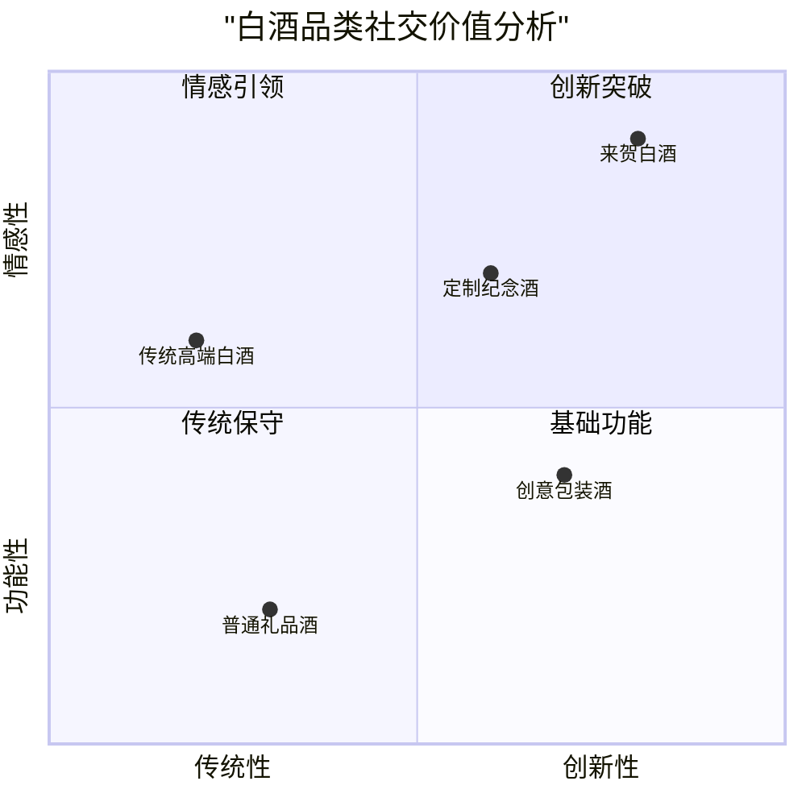

# 社交白酒市场洞察报告

## 1. 市场痛点分析

### 1.1 当代社交困境

#### 核心痛点
- 社交场合交流障碍
- 礼品选择困扰
- 社交记忆度低
- 仪式感缺失

#### 用户需求演变
- 从简单社交到深度连接
- 从物质价值到情感价值
- 从被动接受到主动参与

### 1.2 礼品市场现状

## 2. 用户心理分析

### 2.1 社交焦虑来源
- 场景复杂度提升
- 关系维护压力
- 互动话题匮乏
- 记忆点缺失

### 2.2 用户价值诉求
- 渴望被记住
- 期待互动共鸣
- 追求品位表达
- 寻求社交认同

## 3. 创新机会点

### 3.1 产品创新方向
- 互动仪式设计
- 情感连接强化
- 记忆点植入
- 文化价值传承

### 3.2 传播策略建议

#### 核心信息框架
1. 情感共鸣（首要）
   - 社交场景故事
   - 真实情感表达
   - 互动体验展示

2. 价值主张（其次）
   - 独特设计理念
   - 文化传承创新
   - 优质工艺背书

#### 传播节奏设计
- 第一层：情感触动
- 第二层：场景共鸣
- 第三层：解决方案
- 第四层：产品价值

## 4. 战略建议

### 4.1 用户体验优化
1. 闪卡设计建议
   - 控制展示时长（3-5秒）
   - 场景真实共鸣
   - 情感层层递进
   - 自然引导转化

2. 内容结构优化
   - 减少产品直接展示
   - 强化情感连接
   - 突出互动体验
   - 弱化技术参数

### 4.2 转化路径设计
1. 情感共鸣
   ↓
2. 场景认同
   ↓
3. 解决方案展示
   ↓
4. 产品价值呈现
   ↓
5. 购买决策促进

## 5. 执行建议

### 5.1 短期行动建议
1. 网站改版重点
   - 设计情感闪卡系统
   - 优化内容层级结构
   - 强化场景化展示
   - 简化产品信息

2. 内容创作方向
   - 发掘真实社交故事
   - 创作情感共鸣文案
   - 拍摄场景化视频
   - 设计互动演示内容

### 5.2 长期发展建议
1. 建立用户社交故事池
2. 发展线下互动体验
3. 构建品牌社交生态
4. 深化文化价值传承

## 6. 评估指标

### 6.1 用户行为指标
- 情感共鸣度（停留时间）
- 内容互动率（闪卡点击）
- 场景认同度（分享转发）
- 购买意向度（咨询转化）

### 6.2 品牌发展指标
- 品牌认知度
- 用户口碑传播
- 社交场景渗透
- 文化价值影响